<div align="center">


</div>

<div align="center">
  
</div>

<br/>

<div align="center">
  <a href="https://linkedin.com/in/danny-soundarajd"></a>
  &nbsp;
  <a href="mailto:YOUR_EMAIL@gmail.com"></a>
  &nbsp;
  <a href="https://x.com/Danny_D_07"></a>
  &nbsp;
  <a href="https://github.com/DannySoundarajD/Sentinel"></a>
  &nbsp;
  
</div>

---

## ▍About Me
<div align="center">
  
</div>

## 🏛️ Organisations

<div align="center">

| Organisation | Role | Domain |
|---|---|---|
| [DerpFest-AOSP](https://github.com/DerpFest-AOSP) | **Official Maintainer** | Android 16, sm6150, Xiaomi Redmi Note 10 Pro (sweet) |
| [DerpFest-Devices](https://github.com/DerpFest-Devices) | Contributor | Device tree configs, board files |
| RMDEC | 3rd Year Student | Information Technology |

</div>

---

## 🚀 Active Projects

| Project | Stack | What it does | Status |
|---------|-------|-------------|--------|
| 🛡️ **[Sentinel AI](https://github.com/DannySoundarajD/Sentinel)** | Rust · Axum · SQLite · Ollama · Electron | Local-first AI agent — Vault memory, Guardian monitor, context budgeting, 25 API endpoints | 🟢 v0.1.0 |
| 🏥 **[MediSync](https://github.com/DannySoundarajD/MediSync)** | React · FastAPI · MongoDB · Gemini | AI-assisted healthcare management — patients, providers, clinical workflows | 🚧 Building |
| 🌉 **[HealthBridge](https://github.com/DannySoundarajD/HealthBridge)** | Flutter · Node.js · Firebase | Digital healthcare ecosystem — accessibility, coordination, service delivery | 🚧 Building |
| 🖥️ **[SentinX OS](https://github.com/DannySoundarajD/SentinX-OS)** | Linux · Rust · Sentinel | AI-native Linux distro — Sentinel ships as the OS intelligence layer | 🔒 WIP |
| 📱 **[DerpFest sweet](https://github.com/DerpFest-Devices/device_xiaomi_sweet)** | AOSP · C · Makefile · Soong | Android 16 official build for sm6150 | 🟢 Active |

> **Note:** MediSync, HealthBridge, and SentinX OS URLs are placeholders — replace with your actual repo paths once public.

---

## ⚙️ Advanced Stack

<div align="center">

### 🧠 AI Infrastructure & Local LLM


### 🦀 Systems Programming


### 🤖 Agentic & Claude-Code-Style Dev


### 🐧 Linux Internals & Custom OS

-6E40C9?style=flat-square)


### 📱 Android Kernel & ROM


### 🌐 Product & Full Stack


</div>

---


## 📊 GitHub Stats

<div align="center">

<!-- Language breakdown — custom card styling -->
<a href="https://github.com/DannySoundarajD">
  
</a>

<!-- Activity graph — full width, more visual than cards -->


<!-- Streak separately — cleaner than the combined card -->


</div>

---

## 🏆 Highlights

- 🛡️ **Sentinel AI v0.1.0** — 2.08MB Rust binary, Vault memory with token budgeting, zero vector DB needed
- 📱 **DerpFest AOSP Official Maintainer** — Android 16 for Xiaomi Redmi Note 10 Pro (sweet / sm6150)
- 🖥️ **SentinX OS** — designing an AI-native Linux distro from scratch (under development)

---

## 🎯 Current Focus

```
🛡️ Sentinel v0.2.0        AppImage + voice input + Pro memory mode
🖥️ SentinX OS             AI-native Linux distro, Sentinel as the OS brain (under development)
📱 DerpFest Android 16    sm6150 device tree maintenance
🏥 MediSync + HealthBridge Healthcare AI platforms
```

---

## 💡 Philosophy

> *"The best AI system is the one that works when the internet goes down.
> Local inference. Local memory. Local everything."*

---

<div align="center">
  
</div>

<div align="center">
  <sub>
    AI Infrastructure · DerpFest AOSP Maintainer ·
   Context Window Engineer · Arch Linux · Ships offline
  </sub>
</div>